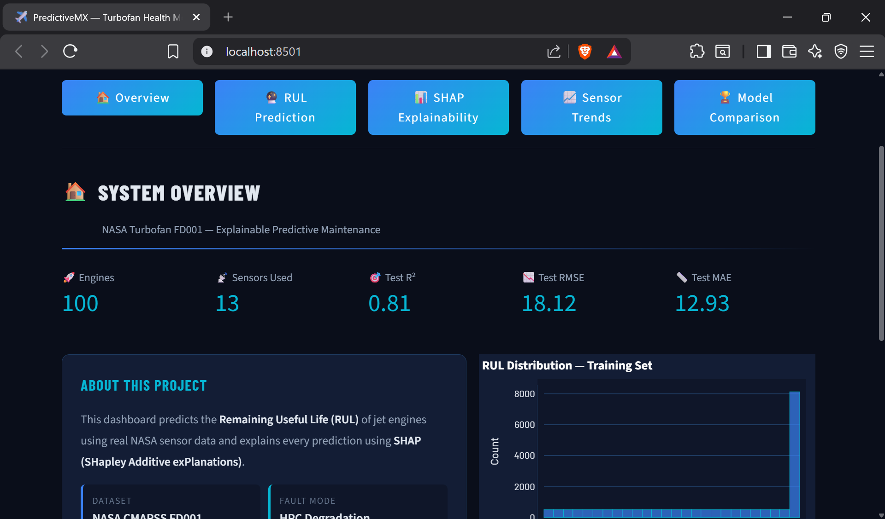
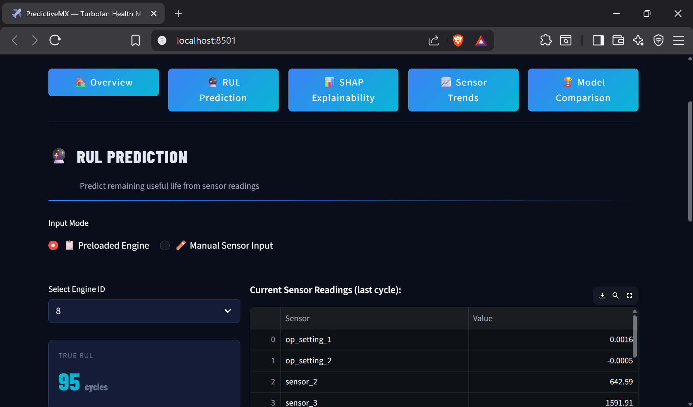
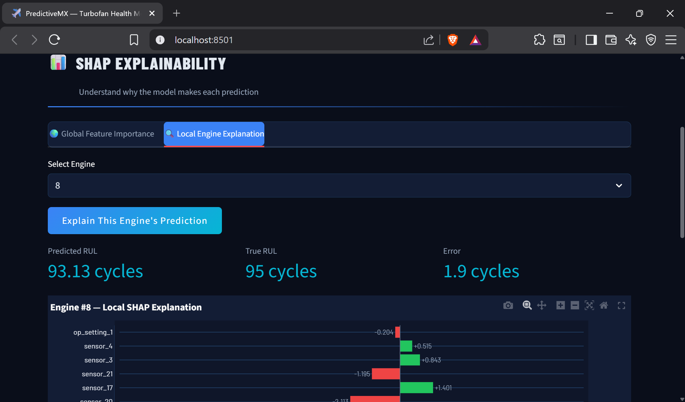
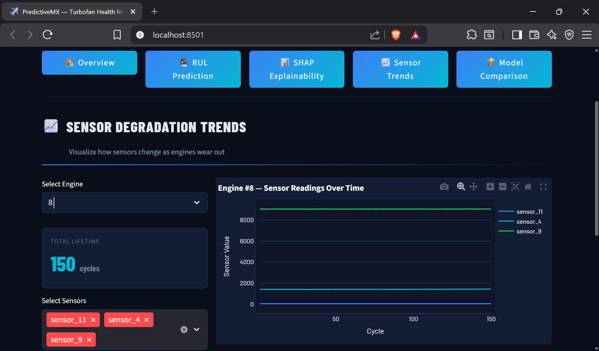
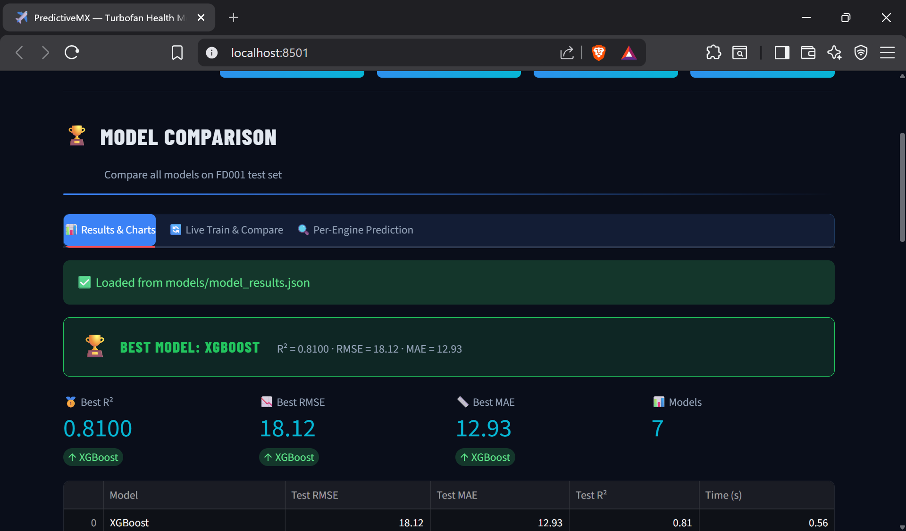

# 🔧 Explainable Predictive Maintenance for Industrial IoT

> An end-to-end Machine Learning system that predicts the **Remaining Useful Life (RUL)** of jet engines using NASA sensor data — with full **SHAP explainability** and a 5-page interactive Streamlit dashboard.

---

## 📸 Dashboard Screenshots

| Overview | RUL Prediction |
|---|---|
|  |  |

| SHAP Explainability | Sensor Trends | Model Comparison |
|---|---|---|
|  |  |  |

---

## 🧠 What It Does

This project addresses a real industrial problem — **predicting when a machine will fail** before it actually does. Using NASA's CMAPSS FD001 turbofan engine dataset, the system:

- Predicts how many cycles remain before an engine fails (RUL)
- Explains **why** the model made each prediction using SHAP values
- Visualizes sensor degradation trends over an engine's lifetime
- Compares 7 ML models on the same test set with live retraining capability

---

## 📊 Results

| Metric | Score |
|---|---|
| **Best Model** | XGBoost |
| **Test R²** | 0.81 |
| **Test RMSE** | 18.12 cycles |
| **Test MAE** | 12.93 cycles |
| **Models Compared** | 7 |

---

## 🏗️ Project Architecture

```
Predictive-Maintenance-RUL/
├── backend/
│   ├── predict.py          # Prediction logic
│   └── __init__.py
├── models/
│   ├── xgb_model.pkl       # Best trained model
│   ├── feature_cols.pkl    # Selected feature columns
│   ├── all_models.pkl      # All 7 trained models
│   ├── model_results.json  # Benchmark results
│   ├── train_df.csv        # Processed training data
│   ├── test_df.csv         # Processed test data
│   └── rul_df.csv          # True RUL labels
├── notebooks/
│   └── rul-ml-project-final.ipynb  # Full training pipeline
├── assets/                 # Dashboard screenshots
├── app.py                  # Streamlit dashboard
└── requirements.txt
```

---

## ⚙️ Tech Stack

| Component | Technology |
|---|---|
| Dataset | NASA CMAPSS FD001 (100 engines, 21 sensors) |
| Best Model | XGBoost Regressor |
| Explainability | SHAP (TreeExplainer) |
| Dashboard | Streamlit |
| Data Processing | Pandas, NumPy, Scikit-learn |
| Visualization | Plotly, Matplotlib |

---

## 🔬 ML Pipeline

### 1. Data Preprocessing
- Loaded NASA FD001 dataset with 26 columns (unit ID, cycle, 3 op settings, 21 sensors)
- Engineered RUL labels with **piecewise linear capping at 125 cycles** to reduce noise in early-life predictions
- Dropped low-variance sensors and `op_setting_3` (near-zero variance across all engines)
- Final feature set: **13 sensors + 2 operational settings**

### 2. Model Training & Comparison
Trained and benchmarked 7 models on identical train/test splits:

| Model | Test RMSE | Test MAE | Test R² |
|---|---|---|---|
| **XGBoost** ⭐ | **18.12** | **12.93** | **0.81** |
| LightGBM | — | — | — |
| Random Forest | — | — | — |
| Gradient Boosting | — | — | — |
| Ridge Regression | — | — | — |
| Lasso Regression | — | — | — |
| KNN | — | — | — |

### 3. SHAP Explainability
Used `shap.TreeExplainer` to generate:
- **Global feature importance** — which sensors matter most across all engines
- **Local explanations** — why the model predicted a specific RUL for a specific engine
- Top predictors identified: `sensor_11`, `sensor_9`, `sensor_4`

---

## 🖥️ Dashboard Pages

1. **🏠 Overview** — Dataset stats, model metrics, RUL distribution chart
2. **🤖 RUL Prediction** — Select engine by ID or input manual sensor readings, get predicted vs true RUL
3. **📊 SHAP Explainability** — Global feature importance + local per-engine SHAP waterfall charts
4. **📈 Sensor Trends** — Visualize how individual sensors degrade over an engine's lifetime
5. **🏆 Model Comparison** — Side-by-side benchmark of all 7 models with live retraining option

---

## 🖥️ Run Locally

### 1. Clone the repo
```bash
git clone https://github.com/mlwithwahid/Predictive-Maintenance-RUL.git
cd Predictive-Maintenance-RUL
```

### 2. Install dependencies
```bash
pip install -r requirements.txt
```

### 3. Run the Streamlit app
```bash
streamlit run app.py
```

App opens at `http://localhost:8501`

---

## 📁 Dataset

This project uses the **NASA CMAPSS FD001** dataset (Turbofan Engine Degradation Simulation).

- 100 training engines, 100 test engines
- Fault mode: HPC Degradation
- 21 sensors + 3 operational settings per cycle

Download from: [NASA Prognostics Data Repository](https://www.nasa.gov/intelligent-systems-division/discovery-and-systems-health/pcoe/pcoe-data-set-repository/) or [Kaggle](https://www.kaggle.com/datasets/behrad3d/nasa-cmaps)

> ⚠️ Dataset not included in this repo. Place files in `models/` after downloading.

---

## 📄 License
MIT License

---

## 👤 Author

**Shaikh Abdul Wahid**
BTech Computer Science (AI/ML) — 2026
- 🐙 GitHub: [@mlwithwahid](https://github.com/mlwithwahid)
- 💼 LinkedIn: [shaikh-abdul-wahid](https://www.linkedin.com/in/shaikh-abdul-wahid-78a13a2b5)
